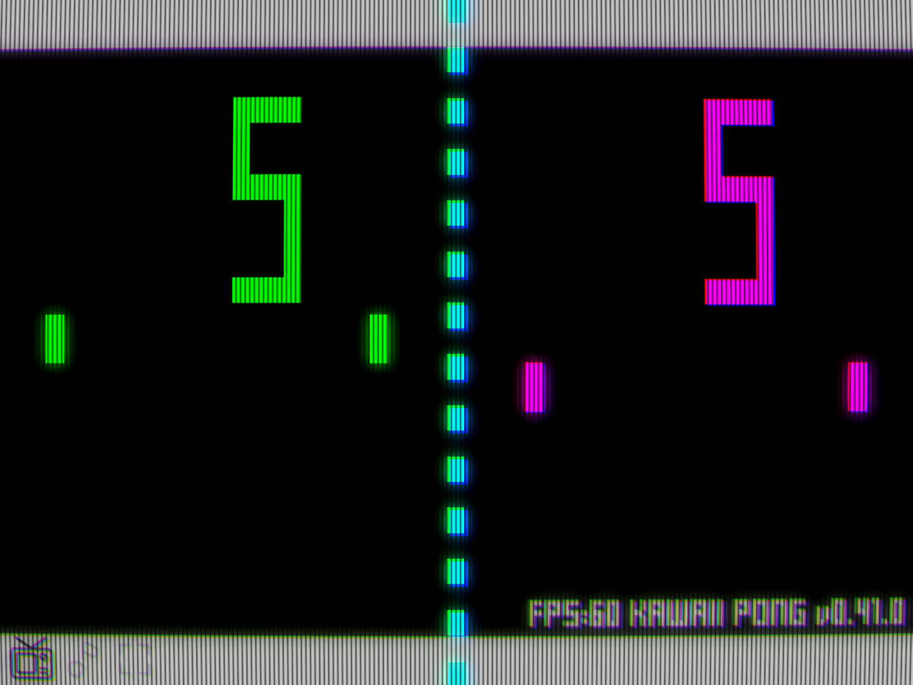

# Hi there! 👋 I'm Joshua Folkken

**Indie Game Developer & Educator** | Japan 🇯🇵  
*Creating games that bring smiles to children's faces and contribute to society through technology.*

## 🚀 Featured Projects

### 🏃‍♂️ **Godot 2D Platformer** 🔥 *Currently Working On* 🔥
Features dash mechanics, high jumps, and double jumps like Mario!  
🎮 [Live Demo](https://joshuafolkken.github.io/godot-2d-platformer/) | 📂 [GitHub](https://github.com/joshuafolkken/godot-2d-platformer)

### 🎬 **Tic-Tac-Toe** - *Strategy Game*
A classic game reimagined, inspired by the 1983 movie WarGames  
🎮 [Live Demo](https://joshuafolkken.github.io/tic-tac-toe/) | 📂 [GitHub](https://github.com/joshuafolkken/tic-tac-toe)

### 🎾 **KAWAII PONG** - *Action Game*
Inspired by the 1976 SUPER PONG with a kawaii twist  
🎮 [Live Demo](https://joshuafolkken.github.io/pong/) | 📂 [GitHub](https://github.com/joshuafolkken/pong)  

### 🛠️ Development Tools & Templates
- 📋 **Godot Project Template**  
  A minimalist template for rapid Godot 4 development  
📂 [GitHub](https://github.com/joshuafolkken/godot-project-template) | 🎮 [Live Demo](https://joshuafolkken.github.io/godot-project-template/)   

- 👥 **Godot Multiplayer**  
  Exploring multiplayer game development with Godot  
  📂 [GitHub](https://github.com/joshuafolkken/godot-multiplayer)  

## 🌟 What I Do

### 🎮 Game Development
- **Engine**: Godot 4 with Typed GDScript
- **Focus**: 2D Platformers, Multiplayer Games, Classic Game Recreation
- **Future**: VR/AR Game Development

### 👨‍🏫 Community & Education
- **Career Counseling**: Supporting young people aspiring to become engineers
- **Programming Workshops**: Teaching programming to children and young adults
- **Gaming Sessions**: Organizing game explanation sessions for children and elderly
- **Community Building**: Running communities for aspiring engineers

## 🛠️ Tech Stack

### 🎮 Game Development

### 💻 Programming Languages

### 🌐 Web Technologies

### 🗄️ Databases & Cloud

### 📱 Mobile Development

### 🖥️ Desktop Development

### 🖥️ Infrastructure & Servers

### 📚 Learning & Documentation

### 🔧 Development Tools & IDEs

### 🔍 Code Quality & Testing

### 🌐 Web Servers & Proxies

### ♻️ CI/CD & Automation

## 📊 GitHub Stats

## 🌈 Philosophy
*"Small thoughts from each individual support today's children and tomorrow's society."*

With 25+ years of engineering experience, I'm dedicated to nurturing the next generation of developers while creating games that bring joy and learning opportunities to people of all ages.

## 💖 Community Support
I believe in giving back to the community. Through **[Joshua Studio on Open Collective](https://opencollective.com/joshua-studio)**, we support:

- 👥 Career consultation sessions for aspiring engineers
- 🎓 Job hunting and skill development support
- 👶 Programming workshops for children and youth
- 🎮 Game explanation sessions for children and elderly
- 🏗️ Infrastructure development and new technology research
- 🐛 Software bug fixes and manual improvements

> **"Creating a Brighter Future - 私達はゲームやツールの制作を通して、子どもたちの明るい笑顔を支える社会貢献を行います"**

## 📫 Connect With Me
- **🐦 Twitter**: [@joshuafolkken](https://twitter.com/joshuafolkken)
- **📺 YouTube**: [@Joshuafolkken-studio](https://www.youtube.com/@Joshuafolkken-studio)
- **🎮 Games**: [itch.io](https://joshuafolkken.itch.io/)
- **💖 Support Our Mission**: [OpenCollective](https://opencollective.com/joshua-studio)

---
⭐️ **Thanks for visiting! If you find my work meaningful, consider starring my repositories or supporting our mission through Open Collective!** ⭐️

*All source code is available for learning purposes. Let's build a brighter future together! 🌟*
